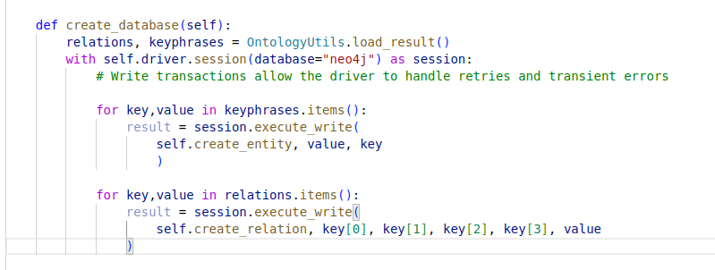
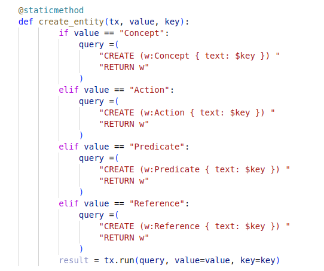
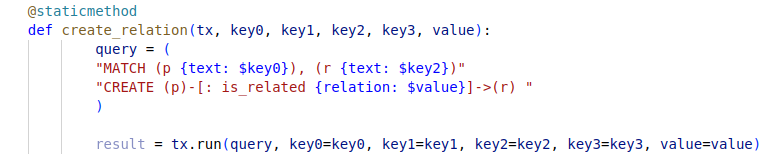
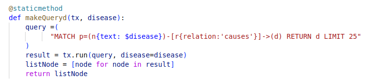
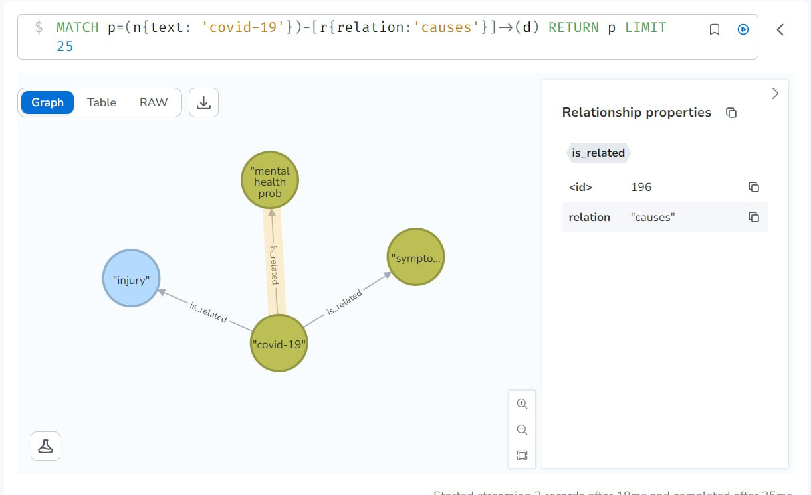
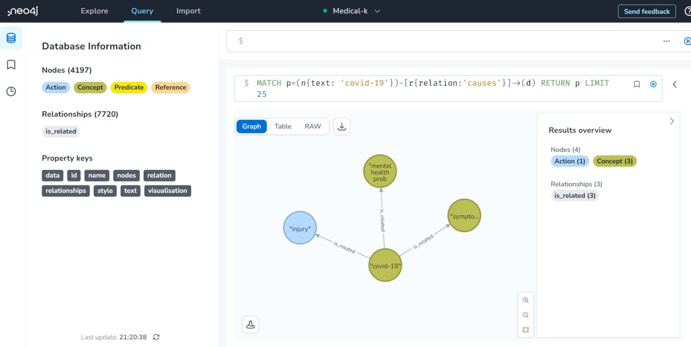
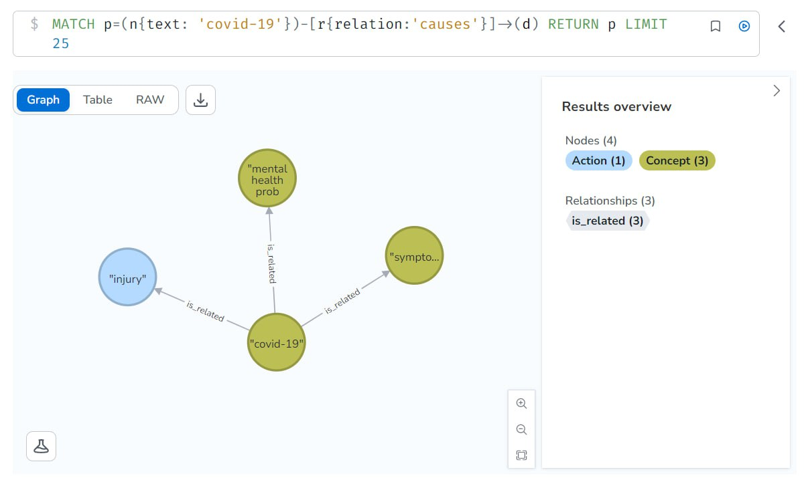

# Extracción de Conocimiento Multilingüe en Textos Médicos mediante el uso de Modelos de Lenguaje

### Integrantes:
(Poner Integrantes con Grupo)

### Resumen:
En este estudio, abordamos el desafío de la extracción de conocimiento a partir de textos médicos mediante la identificación de entidades, su clasificación y la detección de relaciones entre ellas. Para llevar a cabo estas tareas de Extracción de Entidades Nombradas (NER) y Extracción de Relaciones (RE), experimentamos con diversos modelos de procesamiento del lenguaje natural como BiLSTM, BERT, T5 y GPT3. A través de nuestras pruebas comparativas, encontramos que T5 demostró ser el modelo más robusto para estas tareas, superando a los demás en términos de precisión y eficiencia. Además, para maximizar la utilidad de los conocimientos extraídos, desarrollamos una ontología en una base de datos en formato de grafo utilizando Neo4J. Este recurso proporciona una plataforma para la exploración y el uso futuro de los resultados inferidos, potenciando la accesibilidad y aplicabilidad de los valiosos conocimientos extraídos de los textos médicos.

### Abstract:
In this study, we tackle the challenge of knowledge extraction from medical texts by identifying entities, their classification, and detecting relationships between them. To perform these Named Entity Recognition (NER) and Relation Extraction (RE) tasks, we experimented with various natural language processing models such as BiLSTM, BERT, T5, and GPT3. Through our comparative tests, we found that T5 proved to be the most robust model for these tasks, surpassing others in terms of accuracy and efficiency. Furthermore, to maximize the utility of the extracted knowledge, we developed an ontology in a graph-formatted database using Neo4J. This resource provides a platform for the exploration and future use of the inferred results, enhancing the accessibility and applicability of the valuable knowledge extracted from medical texts.

## Introduccion:
La era digital actual ha llevado a un crecimiento explosivo en la generación y disponibilidad de datos, especialmente en el campo de la medicina. Sin embargo, la mayoría de estos datos son textos no estructurados que requieren métodos de procesamiento sofisticados para extraer conocimientos valiosos. Es en este contexto que surge el desafío que abordamos en este trabajo: la extracción de conocimiento a partir de textos médicos mediante la identificación de entidades y la detección de relaciones entre ellas.

En la literatura científica, se han propuesto diversos enfoques para abordar este problema, que abarcan desde métodos basados en reglas hasta enfoques de aprendizaje supervisado y no supervisado. Sin embargo, el surgimiento de técnicas de procesamiento de lenguaje natural (NLP) basadas en aprendizaje profundo ha abierto nuevas puertas para la extracción de conocimientos de textos médicos. Específicamente, los modelos como BiLSTM, BERT, T5, y GPT3 han demostrado ser particularmente efectivos para tareas de Extracción de Entidades Nombradas (NER) y Extracción de Relaciones (RE). 

En este trabajo, experimentamos con estos modelos y evaluamos su rendimiento en la tarea de extracción de conocimiento de textos médicos. Nuestra investigación se enfocó en identificar qué modelo es el más robusto y efectivo para estas tareas. Sin embargo, no nos limitamos a la simple identificación y clasificación de entidades; también exploramos cómo estas entidades se relacionan entre sí para construir una representación más rica y útil del conocimiento contenido en los textos médicos.

Además, para facilitar el uso futuro de los conocimientos extraídos, desarrollamos una ontología en una base de datos en formato de grafo usando Neo4J. Esta ontología no solo almacena las entidades y relaciones identificadas, sino que también permite consultas complejas y análisis de red, abriendo nuevas posibilidades para el uso de los datos.

Este trabajo aporta una contribución valiosa al campo de la extracción de conocimiento de textos médicos, no solo al evaluar el rendimiento de varios modelos de NLP de vanguardia, sino también al proponer una forma novedosa de almacenar y utilizar los conocimientos extraídos. Creemos que nuestros hallazgos serán de interés para los investigadores y profesionales que trabajan en la intersección de la medicina, la informática y la inteligencia artificial.

## Estado del Arte:
(IMPORTANTE, AGREGAR REFERENCIAS EN EL ESTADO DEL ARTE)
El Estado del Arte en la extracción de entidades y relaciones de textos médicos ha avanzado rápidamente en los últimos años gracias a los avances en el Procesamiento de Lenguaje Natural (NLP) y en particular, al aprendizaje profundo.

La Extracción de Entidades Nombradas (NER) ha sido una tarea fundamental en NLP durante mucho tiempo. Los enfoques tradicionales solían incluir técnicas basadas en reglas y métodos de aprendizaje automático supervisado que utilizaban características manuales. Sin embargo, con el advenimiento del aprendizaje profundo, los modelos basados en redes neuronales recurrentes (RNN) como LSTM y GRU han mostrado un rendimiento impresionante en tareas de NER. En particular, el modelo BiLSTM, que procesa la secuencia de entrada en ambas direcciones, ha sido ampliamente utilizado para tareas de NER debido a su capacidad para capturar el contexto de ambas direcciones.

Para la tarea de Extracción de Relaciones (RE), los modelos basados en Transformadores, como BERT de Google, han demostrado ser particularmente eficaces. BERT presenta una nueva arquitectura que se basa en la atención de múltiples cabezas y ha demostrado tener un rendimiento superior en varias tareas de NLP, incluyendo RE. Otra variante, BioBERT, un modelo preentrenado en textos biomédicos, ha obtenido resultados aún mejores en las tareas de RE en el dominio médico.

En cuanto a los conjuntos de datos para la evaluación de estas tareas, se han utilizado varios corpus en la literatura. Un ejemplo notorio es el corpus eHealth-KD, que proporciona un conjunto de datos anotados en el dominio de la salud. Este conjunto de datos incluye entidades y relaciones etiquetadas, y ha sido utilizado en varias competencias científicas para evaluar el rendimiento de diferentes enfoques para las tareas de NER y RE.

Además de eHealth-KD, existen otras bases de datos relevantes como SemEval, BioNLP, i2b2, y MIMIC-III, que son ampliamente utilizadas en el campo del procesamiento de texto biomédico y médico. Estos conjuntos de datos, que varían en tamaño, complejidad y enfoque, proporcionan una amplia gama de contextos para probar y evaluar métodos de NER y RE.

En resumen, el estado del arte en la extracción de entidades y relaciones de textos médicos está dominado por los enfoques de aprendizaje profundo, con modelos como BiLSTM y BERT que ofrecen un rendimiento superior. Sin embargo, la elección del modelo adecuado puede depender del contexto específico y del conjunto de datos disponibles, y la investigación en este campo sigue siendo un área activa y en evolución.

## Dataset:
El dataset utilizado en nuestro proyecto se basó en el corpus (AGREGAR REFERENCIA!!). Este dataset tiene las siguientes características:

- Es multidominio y multilingüe, lo que significa que abarca una variedad de temas relacionados con la salud y contiene oraciones en diferentes idiomas.
- Todas las oraciones del dataset están relacionadas con temas de salud, lo que proporciona una gran variedad en términos de formato y estructura.
- Cada oración del dataset está etiquetada, lo que significa que se conoce el dominio al que pertenece y el idioma correspondiente.
- En el conjunto de entrenamiento, se tienen un total de 1400 oraciones, de las cuales 1200 están en español y 200 en inglés.
- En el conjunto de pruebas, se tienen un total de 100 oraciones, de las cuales 75 están en español y 25 en inglés.
- Para evaluar la extracción de entidades, se utilizó un coeficiente de Gini de 0.39, lo que indica un rendimiento moderado en esta tarea.
- Para evaluar la extracción de relaciones, se utilizó un coeficiente de Gini de 0.58, lo que indica un rendimiento más alto en esta tarea.

Este dataset proporciona una base sólida para el entrenamiento y evaluación de modelos de extracción de conocimiento en el campo de la salud, con una variedad de oraciones etiquetadas en diferentes idiomas y dominios.

## Propuestas:

### BiLSTM:
Nuestra solución para ambas tareas se basa en Redes Neuronales Recurrentes (RNN) o, más precisamente, en Memoria a Largo Plazo Bidireccional (BiLSTM) como codificadores contextuales y capas densas como la arquitectura del decodificador de etiquetas del modelo. Esta arquitectura es elegida debido a la estructura secuencial de la entrada y es ampliamente utilizada en la literatura para abordar el problema del Reconocimiento de Entidades Nombradas (NER). El sistema utiliza información de etiquetas POS (Part-of-Speech tag), relaciones de dependencia, representaciones a nivel de caracteres, así como incrustaciones contextuales. La tarea de Extracción de Relaciones (RE) se aborda de manera pareada, codificando la información sobre la oración y el par de entidades dado utilizando estructuras sintácticas derivadas del árbol de análisis de dependencia. Además, se utilizó un tipo especial de relación para codificar la relación entre pares de entidades no relacionadas.

#### Implementacion:
La solución propuesta resuelve ambas tareas de manera separada y secuencial. Por lo tanto, se entrenaron modelos independientes con diferentes arquitecturas y características para resolver los problemas de NER y RE. La principal distinción entre las dos arquitecturas surge del tipo de problema que resuelven. La primera tarea se plantea como un problema de predicción de etiquetas que toma el texto sin procesar de una oración como entrada y genera dos secuencias de etiquetas independientes: una en el sistema de etiquetas BILOUV para la predicción de entidades y otra con las etiquetas correspondientes a cada tipo de entidad (Concepto, Acción, Referencia, Predicado). 

La clasificación del esquema de etiquetas BILOUV corresponde a Begin, para el inicio de una entidad; Inner, para el token en medio; Last para el token final; Unit, para representar entidades de un solo token; Other para representar tokens que no pertenecen a ninguna entidad, y la etiqueta oVerlapping se utiliza para lidiar con tokens que pertenecen a múltiples entidades. Por otro lado, la segunda tarea se aborda como una serie de consultas por pares entre las entidades presentes en la oración objetivo, orientada a identificar las relaciones relevantes entre las entidades previamente extraídas.

Teniendo en cuenta las características multilingües de la tarea, el proceso de extracción de características de las características sintácticas se maneja en dos fases. En la primera, la oración de entrada se clasifica por su idioma utilizando un modelo preentrenado de FastText para la identificación del idioma. Posteriormente, en la segunda fase, se utilizaron dos modelos diferentes de Spacy (https://spacy.io/) dependiendo del idioma de la oración (es core news sm para español y en core web sm para inglés). Estos modelos se utilizaron para extraer características como la etiqueta POS, el árbol de análisis de dependencia y la etiqueta de dependencia.

### Bert:
En esta seccion se aborda la tarea de reconocimiento de entidades nombradas (NER) utilizando el modelo BERT (Bidirectional Encoder Representations from Transformers). La NER es una tarea crucial en el procesamiento del lenguaje natural para identificar y clasificar entidades relevantes en textos médicos, como enfermedades, síntomas, medicamentos, etc. Para este proyecto, se utilizó el conjunto de datos eHealthKD2021, que proporciona información médica relevante para entrenar y evaluar el modelo.

En la actualidad, BERT se considera uno de los modelos de lenguaje más avanzados en NLP debido a su capacidad para capturar el contexto bidireccional de las palabras en una oración o secuencia de texto. Esto permite comprender mejor las relaciones y significados de las palabras en un contexto específico, lo que resulta beneficioso para tareas como la NER en el campo médico.

#### Implementacion:
En este proyecto, se siguió el siguiente método para ajustar el modelo BERT y abordar la tarea de NER en el conjunto de datos médicos eHealthKD2021:

1. Preprocesamiento de datos: Los datos de eHealthKD2021 se prepararon para que fueran compatibles con el formato de entrada requerido por BERT. Se tokenizó el texto y se agregaron los marcadores especiales [CLS] (inicio) y [SEP] (final). Además, se aplicaron técnicas de tokenización para dividir las palabras en subunidades más pequeñas y mejorar la capacidad del modelo para identificar entidades.

2. Ajuste del modelo BERT: Se utilizó una implementación preentrenada de BERT y se ajustaron los hiperparámetros para adaptar el modelo a la tarea de NER con los datos médicos. Se seleccionó la arquitectura BERT apropiada y se configuraron los hiperparámetros, como la tasa de aprendizaje y el tamaño del lote. El modelo se entrenó utilizando el conjunto de datos de entrenamiento durante 2 epochs (épocas) para ajustar los pesos y mejorar su rendimiento en la tarea de NER.

3. Evaluación del modelo: Una vez ajustado el modelo, se evaluó su desempeño utilizando el conjunto de datos de prueba. Se utilizaron métricas estándar de evaluación de NER, como precisión, recobrado y F1, para medir la calidad del modelo en la identificación de entidades.

### T5:
T5, que significa "Text-to-Text Transfer Transformer", es un modelo de procesamiento de lenguaje natural desarrollado por Google. La idea principal detrás de T5 es tratar todas las tareas de NLP como un problema de generación de texto. Esto significa que tanto la entrada como la salida del modelo son siempre texto.

El modelo T5 se entrena en un objetivo de "denoising", es decir, se le dan cadenas de texto con ruido (por ejemplo, palabras borradas o enmascaradas) y se le pide que genere el texto original. Este enfoque es similar a otros modelos basados en transformadores como BERT, pero a diferencia de BERT y otros, T5 se entrena para generar cualquier tipo de texto, no sólo completar los espacios en blanco.

El T5 es un modelo de "transformador", lo que significa que utiliza la arquitectura del transformador introducida en el paper "Attention is All You Need" de Vaswani et al. (2017). Esta arquitectura se basa en mecanismos de "atención" que permiten al modelo ponderar diferentes partes del texto de entrada cuando genera la salida, lo que le permite capturar relaciones a largo plazo en el texto.

Una de las ventajas clave del modelo T5 es su versatilidad. Debido a su enfoque de "texto a texto", puede ser utilizado para una amplia gama de tareas de NLP, incluyendo traducción de lenguaje, generación de resúmenes, respuesta a preguntas, y muchas otras, simplemente cambiando la forma en que se formatea la entrada.

El T5 ha demostrado ser un modelo muy poderoso y ha obtenido resultados de vanguardia en una variedad de tareas de benchmarking de NLP. Sin embargo, al igual que otros modelos de gran tamaño, requiere una gran cantidad de recursos computacionales para entrenar y utilizar. A pesar de este desafío, el T5 representa un avance significativo en el campo de NLP y continúa influenciando el desarrollo de nuevos modelos y técnicas.

##### NER:
El archivo NER_T5_spacy.ipynb contiene el pipeline de la propuesta de solucion a la subtarea A, es decir, reconocimiento de entidades y su clasificacion.
Para llegar a esta solucion se divide el problema en 2 partes:
1- Dada una oracion(en ingles o espanol) detectar las entidades.
2- Dada una entidad, decir el tipo de esta.

Para el primer paso nos apoyamos en la libreria Spacy de Python y descargamos los modulos de ambos idiomas. Esta libreria ya te devuelve una lista de todos los terminos de la oracion con sus respectivas clasificaciones.
Estas clasificaciones no son las mismas que las de nuestro modelo(Concept, Action, Reference, Predicate) asi que modificamos las posibles entidades de Spacy que nos pudieran hacer falta.

Luego, para el segundo paso utilizamos el modelo simple T5 y lo entrenamos(con 5 epoch) para que pudiera se capaz de clasificar las entidades.

En el pipeline se calcula la efectividad de nuestro modelo de forma separada y junta, es decir, calculando la precision, el recobrado y la puntuación F1 podemos ver las estadisticas de cuan exacto es spacy para el paso 1 y cuanto lo es T5 para el paso 2. Luego, se unen ambos metodos para resolver la subtarea A como un todo.

##### RE:
El desafío de Extracción de Conocimiento en Documentos Médicos (eHealth-KD) busca abordar la tarea de identificar y entender las entidades y relaciones presentes en textos médicos. Este informe se centra específicamente en la utilización del modelo Transformer T5 para la tarea de extracción de relaciones.

El modelo T5 (Text-to-Text Transfer Transformer) es una variante del modelo Transformer que se entrenó para convertir texto en texto. Esta configuración generalizada permite que el modelo se aplique a una variedad de tareas, simplemente cambiando el formato del texto de entrada y salida.

En un inicio de la tarea de RE el modelo realizaba un entrenamiento supervisado en el que se le pasaba las entidades y el tipo de relación que existía entre ellas. Pero este enfoque en en entrenamiento no dió los resultados esperados, pues en dependencia del contexto de la oración podría cambiar el tipo de relación entre las entidades.

Para solucionar este problema se decidió cambiar el tipo de entrada del modelo tal que por cada oración se genera un conjunto de oraciones de entrenamiento para cada par de entidades posibles en la oración teniendo estas las entidades marcadas(usa marcas en forma de etiquetas como HTML) y la salida es el tipo de relación. De esta manera, el modelo es entrenado para predecir el tipo de relación entre dos entidades dadas, basándose en el contexto de la oración. Lograndose así un mejor desempeño en la tarea, duplicando la puntuación F1 del modelo.

En este caso se usa la técnica de Transfer Learning para entrenar nuestro modelo usando el modelo pre-entrenado "t5-base", el segundo de 5 en la escala de tamaño de los modelos T5. Además se realizan 4 epochs de entrenamiento, en los cuales se mostraba una mejora de los resultados, pero no se siguió probando en adelante debido a falta de poder de computo y lo costoso que es el entrenamiento en cuanto a tiempo.

Se puede encontrar el pipeline de la propuesta de solución en el archivo `pipeline_lstm_NER_T5_RE.ipynb`.

### Ontología:

En nuestro proyecto una vez obtenido todo el conociemto de los documentos guardamos los datos en una base de datos orientada a grafos.

Una base de datos orientada a grafos (BDOG) representa la información como nodos de un grafo y sus relaciones con las aristas del mismo, de manera que se pueda usar teoría de grafos para recorrer la base de datos ya que esta puede describir atributos de los nodos (entidades) y las aristas (relaciones).

Para ello utilizamos Neo4j. Neo4j permite acceder a sus datos de diversas formas y usando distintos lenguajes de consulta. En nuestro proyecto utilizamos Cypher, un lenguaje que permite consultar y manipular grafos.

Cypher es el lenguaje de consulta de gráficos de Neo4j que le permite recuperar datos del gráfico. Es como SQL para gráficos, y se inspiró en SQL, por lo que le permite concentrarse en los datos que desea obtener del gráfico (no en cómo obtenerlos). Es el lenguaje gráfico más fácil de aprender con diferencia debido a su similitud con otros lenguajes y su intuición.

En el proyecto contamos con cuatro tipos de entidades:

* Concept: identifica un término relevante, concepto, idea, en el dominio de conocimiento de la oración.
* Action: identifica un proceso o modificación de otras entidades. Puede ser indicado por un verbo o construcción verbal, como “afecta” (afecta), pero también por sustantivos, como “exposición”, donde denota el acto de estar expuesto al sol, y “daños” (daños), donde denota el acto de dañar la piel. También se puede utilizar para indicar relaciones funcionales no verbales, como “padre”, etc.
* Predicate: identifica una función o filtro de otro conjunto de elementos, que tiene una etiqueta semántica en el texto, como “mayores” (mayores), y se aplica a una entidad, como “personas” (personas) con algunos argumentos adicionales como “60 años” (60 años).
* Reference: identifica un elemento textual que hace referencia a una entidad –de la misma oración o de otra diferente–, lo que puede indicarse mediante claves textuales como “esta”, “aquel”, etc.

Y las relaciones:
* is-a: indica que una entidad es un subtipo, instancia o miembro de la clase identificada por la otra.
* same-as: indica que dos entidades son semánticamente iguales.
* has-property: indica que una entidad tiene una determinada propiedad o característica.
part-of: indica que una entidad es parte constitutiva de otra.
* causes: indica que una entidad provoca la existencia o ocurrencia de otra.
* entails: indica que la existencia de una entidad implica la existencia o ocurrencia de otra. 
* in-time: para indicar que algo existe, ocurre o está confinado a un marco de tiempo, como en “exposición” in-time “verano”.
in-place: para indicar que algo existe, ocurre o está confinado a un lugar o ubicación.
in-context: para indicar un contexto general en el que sucede algo, como un modo, manera o estado, como “exposición” en contexto “prolongada”.
* subject: indica quién realiza la acción, como en “[el] asma afecta […]”.
* target: indica quién recibe el efecto de la acción, como en “[…] afecta [las] ​​vías respiratorias”. Las acciones pueden tener varios sujetos y destinatarios, en cuyo caso la semántica interpretada es que la unión de los sujetos realiza la acción sobre cada uno de los destinatarios.
* domain: indica la entidad principal sobre la que se aplica el predicado.
* arg: indica una entidad adicional que especifica un valor para que el predicado tenga sentido. La semántica exacta de este argumento depende de la semántica de la etiqueta del predicado, como en “mayores [de] 60 años”, donde la etiqueta del predicado “mayores” indica que “60 años” es una cantidad que restringe la edad mínima para el predicado sea verdadero.

La comunicación con la base de datos se realiza en el siguiente método:

La generación de los nodos como entidades la realizamos con las siguientes consulta:

Para la creación de las relaciones entre los nodos utilizamos la consulta:

Este método realiza una consulta para conocer las causas de alguna enfermedad de interés:

En esta imagen podemos ver los resultado obtenidos al realizar la consulta para conocer las causas del covid-19:

## Resultados:
(HACER LAS TABLITAS DE CADA MODELO PARA TODAS LAS METRICAS DADAS Y MOSTRAR LOS MISMOS GRAFICOS QUE EN LA PRESENTACION)

## Conclusiones:
En conclusión, los resultados de nuestras experimentaciones demostraron la efectividad de los modelos de aprendizaje profundo, específicamente BiLSTM y T5, en la tarea de extracción de conocimiento a partir de textos médicos. En la tarea de extracción de entidades nombradas (NER), el modelo BiLSTM sobresalió con un puntaje F1 de 0.56, demostrando su habilidad para capturar y utilizar la información contextual en la identificación de entidades en el texto.

Por otro lado, para la tarea de extracción de relaciones (RE), el modelo T5 se destacó con un puntaje F1 de 0.63. La superioridad de T5 en esta tarea se puede atribuir a su capacidad para entender y generar texto, lo que es esencial para identificar y clasificar las relaciones entre entidades en el texto.

En términos de rendimiento general, la combinación de BiLSTM y T5 resultó ser la más eficaz, logrando un puntaje F1 de 0.63. Esto sugiere que, aunque los modelos individuales pueden ser eficaces para tareas específicas, la combinación de diferentes enfoques y técnicas puede llevar a un rendimiento mejorado.

Estos resultados subrayan la capacidad del modelo T5 para llevar a cabo tareas de extracción de conocimiento. Aunque BiLSTM demostró ser eficaz en la tarea de NER, T5 demostró una versatilidad superior, siendo capaz de manejar tanto tareas de NER como de RE de manera efectiva. Esto demuestra el potencial de T5 y modelos similares para la extracción de conocimiento a partir de textos, y sugiere direcciones prometedoras para futuras investigaciones y desarrollos en este campo.

## Recomendaciones:
Las siguientes son algunas recomendaciones para futuras investigaciones y mejoras en este proyecto:

1. **Experimentar con modelos más nuevos y potentes**: Aunque T5 ha demostrado ser eficaz en nuestras pruebas, existen modelos de lenguaje más nuevos y más potentes que podrían ser explorados para mejorar aún más la extracción de conocimiento. Modelos como GPT-3 de OpenAI, o modelos como BERT de Google y RoBERTa de Facebook, que utilizan la técnica de Transformer, pueden proporcionar un rendimiento mejorado.

2. **Mejora de los datos de entrenamiento**: Aunque los modelos de aprendizaje profundo son potentes, su rendimiento depende en gran medida de la calidad de los datos de entrenamiento. Podría ser beneficioso invertir más tiempo y recursos en la mejora de los datos de entrenamiento, como la limpieza de los datos, la eliminación de sesgos y la adición de más ejemplos de entrenamiento.

3. **Pruebas con diferentes combinaciones de modelos**: Los resultados indican que la combinación de BiLSTM y T5 fue la más eficaz para la tarea completa de extracción de conocimiento. Esto sugiere que la combinación de diferentes modelos y técnicas podría ser una estrategia eficaz. Futuras investigaciones podrían explorar diferentes combinaciones de modelos y técnicas para mejorar aún más el rendimiento.

4. **Explorar técnicas de preprocesamiento de texto avanzadas**: Antes de alimentar el texto a los modelos de aprendizaje profundo, podría ser útil explorar técnicas avanzadas de preprocesamiento de texto, como la lematización, la eliminación de stopwords y la codificación de entidades.

5. **Incorporación de conocimientos del dominio**: En tareas específicas del dominio, como la extracción de conocimientos médicos, la incorporación de conocimientos del dominio puede mejorar el rendimiento del modelo. Futuras investigaciones podrían explorar formas de incorporar conocimientos médicos en los modelos para mejorar la extracción de entidades y relaciones.

## Referencias:
(AGREGAR LAS REFERENCIAS NECESARIAS)