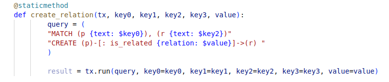
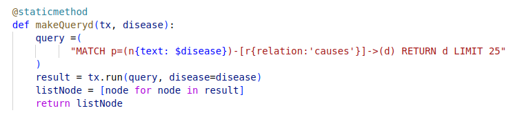
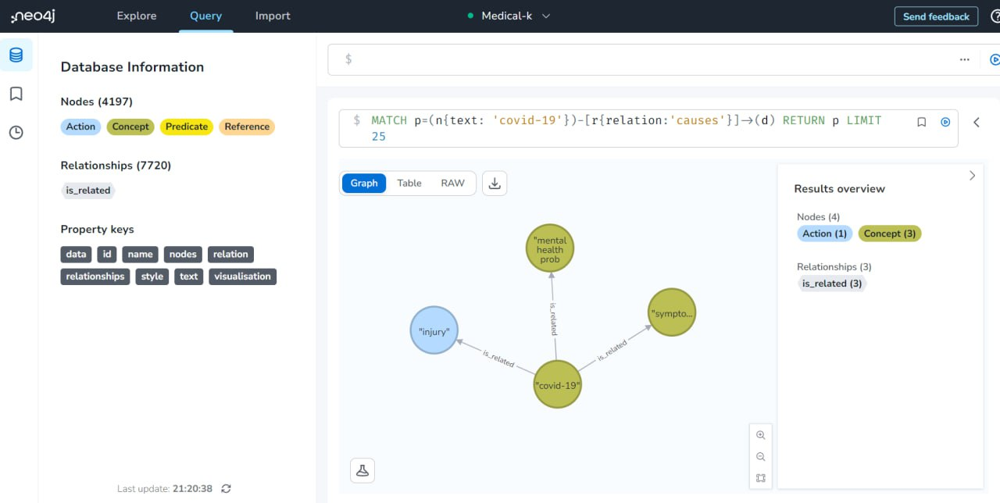

# Ontología

En nuestro proyecto una vez obtenido todo el conociemto de los documentos guardamos los datos en una base de datos orientada a grafos.

Una base de datos orientada a grafos (BDOG) representa la información como nodos de un grafo y sus relaciones con las aristas del mismo, de manera que se pueda usar teoría de grafos para recorrer la base de datos ya que esta puede describir atributos de los nodos (entidades) y las aristas (relaciones).

Para ello utilizamos Neo4j. Neo4j permite acceder a sus datos de diversas formas y usando distintos lenguajes de consulta. En nuestro proyecto utilizamos Cypher, un lenguaje que permite consultar y manipular grafos.

Cypher es el lenguaje de consulta de gráficos de Neo4j que le permite recuperar datos del gráfico. Es como SQL para gráficos, y se inspiró en SQL, por lo que le permite concentrarse en los datos que desea obtener del gráfico (no en cómo obtenerlos). Es el lenguaje gráfico más fácil de aprender con diferencia debido a su similitud con otros lenguajes y su intuición.

En el proyecto contamos con cuatro tipos de entidades:

* Concept: identifica un término relevante, concepto, idea, en el dominio de conocimiento de la oración.
* Action: identifica un proceso o modificación de otras entidades. Puede ser indicado por un verbo o construcción verbal, como “afecta” (afecta), pero también por sustantivos, como “exposición”, donde denota el acto de estar expuesto al sol, y “daños” (daños), donde denota el acto de dañar la piel. También se puede utilizar para indicar relaciones funcionales no verbales, como “padre”, etc.
* Predicate: identifica una función o filtro de otro conjunto de elementos, que tiene una etiqueta semántica en el texto, como “mayores” (mayores), y se aplica a una entidad, como “personas” (personas) con algunos argumentos adicionales como “60 años” (60 años).
* Reference: identifica un elemento textual que hace referencia a una entidad –de la misma oración o de otra diferente–, lo que puede indicarse mediante claves textuales como “esta”, “aquel”, etc.

Y las relaciones:
* is-a: indica que una entidad es un subtipo, instancia o miembro de la clase identificada por la otra.
* same-as: indica que dos entidades son semánticamente iguales.
* has-property: indica que una entidad tiene una determinada propiedad o característica.
part-of: indica que una entidad es parte constitutiva de otra.
* causes: indica que una entidad provoca la existencia o ocurrencia de otra.
* entails: indica que la existencia de una entidad implica la existencia o ocurrencia de otra. 
* in-time: para indicar que algo existe, ocurre o está confinado a un marco de tiempo, como en “exposición” in-time “verano”.
in-place: para indicar que algo existe, ocurre o está confinado a un lugar o ubicación.
in-context: para indicar un contexto general en el que sucede algo, como un modo, manera o estado, como “exposición” en contexto “prolongada”.
* subject: indica quién realiza la acción, como en “[el] asma afecta […]”.
* target: indica quién recibe el efecto de la acción, como en “[…] afecta [las] ​​vías respiratorias”. Las acciones pueden tener varios sujetos y destinatarios, en cuyo caso la semántica interpretada es que la unión de los sujetos realiza la acción sobre cada uno de los destinatarios.
* domain: indica la entidad principal sobre la que se aplica el predicado.
* arg: indica una entidad adicional que especifica un valor para que el predicado tenga sentido. La semántica exacta de este argumento depende de la semántica de la etiqueta del predicado, como en “mayores [de] 60 años”, donde la etiqueta del predicado “mayores” indica que “60 años” es una cantidad que restringe la edad mínima para el predicado sea verdadero.

La comunicación con la base de datos se realiza en el siguiente método:

La generación de los nodos como entidades la realizamos con las siguientes consulta:

Para la creación de las relaciones entre los nodos utilizamos la consulta:

Este método realiza una consulta para conocer las causas de alguna enfermedad de interés:

En esta imagen podemos ver los resultado obtenidos al realizar la consulta para conocer las causas del covid-19:

